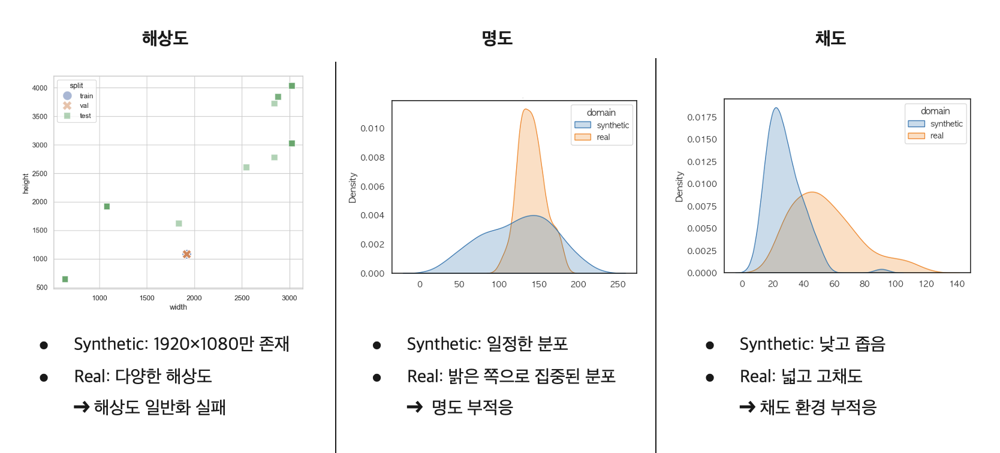
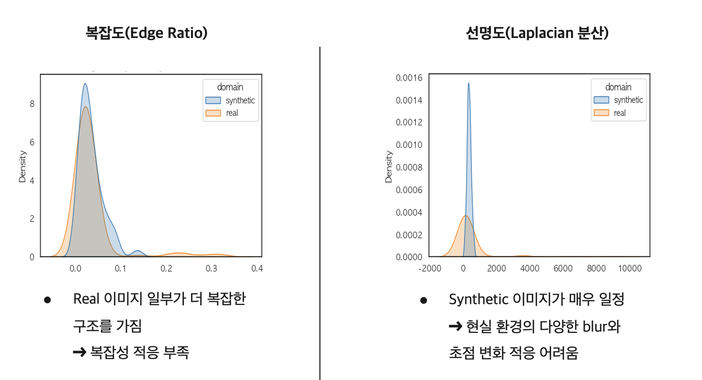
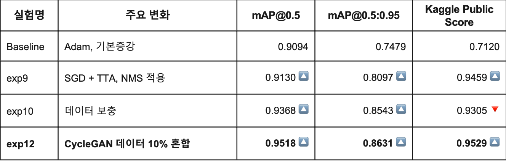

# Synthetic to Real Object Detection Challenge

[Kaggle Synthetic to Real Object Detection Challenge](https://www.kaggle.com/competitions/synthetic-2-real-object-detection-challenge) —  
YOLOv8 + CycleGAN 기반 실험으로 **mAP 11.5%p 개선, Public Score 0.9529 달성**

---

## 📌 프로젝트 개요
이 프로젝트는 **합성(Synthetic) 데이터 기반 Object Detection 모델을 실제 환경(Real)에 일반화**하는 것을 목표로 합니다.  
합성 데이터와 실제 데이터 간의 **도메인 갭(Domain Gap)** 문제를 해결하기 위해 다양한 기법을 실험했습니다.  

---

## 🛠️ 기술 스택
- **Framework**: PyTorch, Ultralytics YOLOv8
- **Data**: Kaggle Synthetic to Real Object Detection dataset
- **GAN**: CycleGAN (Synthetic → Real 스타일 변환)
- **Optimization**: TTA(Test Time Augmentation), NMS 최적화, AdamW Optimizer
- **Environment**: Python, Colab, Kaggle Notebook

---

## 🚀 접근 방법
1. **EDA**: 합성 데이터와 실제 데이터 차이점 분석 (Domain Gap 분석)
 
 

2. **Preprocessing**: 데이터 전처리
   - **데이터 증강**: 기본 증강(RandomFlip, HSV 변환, Mosaic) 적용  
   - **스타일 변환**: CycleGAN으로 합성 데이터를 실제 이미지 스타일로 변환 후 데이터셋 혼합  
3. **최적화**:  
   - Optimizer/Hyperparameter 튜닝 (AdamW, CosineAnnealingLR)  
   - Test Time Augmentation(TTA), NMS threshold 조정  
4. **실험**: 
 

---

## 📈 성과 (Result)
- Baseline YOLOv8: **mAP@0.5 = 0.9**
